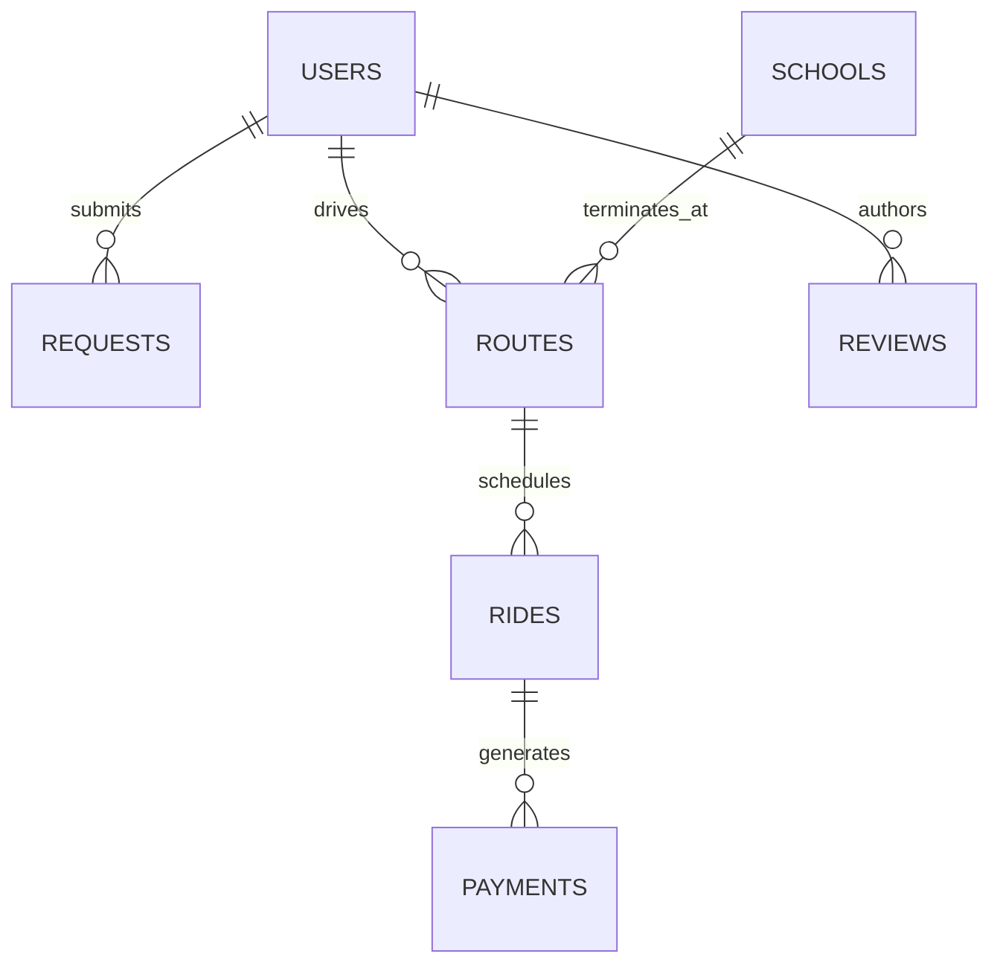

# 🚸 Pick-and-Drop Management System

> **A Comprehensive Multi-Platform Smart School Transport Management, Real-Time GPS Tracking, Cashless Payments, and AI Sentiment-Driven Evaluation System.**
>
> Final Year Project (FYP) — Department of Software Engineering.

---

## 📑 Table of Contents

1. [Project Title](#1-project-title)
2. [Project Overview](#2-project-overview)
3. [Key Features](#3-key-features)
   - [Parent Mobile Experience](#parent-mobile-experience)
   - [Driver Mobile Experience](#driver-mobile-experience)
   - [School & Transport Admin Portal](#school--transport-admin-portal)
   - [Super Admin Executive Portal](#super-admin-executive-portal)
   - [FastAPI AI & Payment Microservice](#fastapi-ai--payment-microservice)
4. [Technology Stack](#4-technology-stack)
5. [Project Architecture & Folder Structure](#5-project-architecture--folder-structure)
6. [Prerequisites & System Requirements](#6-prerequisites--system-requirements)
7. [Installation Instructions](#7-installation-instructions)
8. [Environment Configuration](#8-environment-configuration)
9. [Firebase Setup](#9-firebase-setup)
10. [Google Maps API Configuration](#10-google-maps-api-configuration)
11. [Flutter Mobile App Setup and Run Instructions](#11-flutter-mobile-app-setup-and-run-instructions)
12. [React Admin Panel Setup and Run Instructions](#12-react-admin-panel-setup-and-run-instructions)
13. [FastAPI Backend / Sentiment Analysis Setup and Run Instructions](#13-fastapi-backend--sentiment-analysis-setup-and-run-instructions)
14. [Database & Firestore Configuration](#14-database--firestore-configuration)
15. [How to Run the Complete System](#15-how-to-run-the-complete-system)
16. [Common Setup Issues & Troubleshooting](#16-common-setup-issues--troubleshooting)
17. [Authors & FYP Information](#17-authors--final-year-project-information)

---

## 1. Project Title

### **Pick-and-Drop Management System**
*An Intelligent IoT & AI-Augmented School Transportation and Fleeting Ecosystem.*

---

## 2. Project Overview

The **Pick-and-Drop Management System** is an end-to-end, multi-tier enterprise transport solution designed to eliminate the logistical inefficiencies, lack of real-time visibility, and safety concerns inherent in daily school transportation.

Traditional pick-and-drop operations suffer from severe coordination gaps: parents have no real-time awareness of vehicle delays or student safety, drivers are forced to make manual phone calls while navigating congested roads, administrators lack auditable route records, and manual cash fee collection leads to reconciliation disputes.

This platform bridges all four critical stakeholders—**Super Administrators**, **School/Branch Administrators**, **Drivers**, and **Parents**—into a unified, reactive digital workflow:
- **Real-Time GPS Tracking & Intelligent Routing**: High-precision location streaming from driver devices to cloud datastores, projecting road-following polyline routes with dual-engine routing (Google Directions API with automatic failover to Open Source Routing Machine - OSRM).
- **Automated Student Manifest & Status Workflows**: Transparent pickup and drop-off status checkpoints backed by local and in-app push notifications.
- **Strict Role-Based Security & Driver Verification**: Document upload, background vetting, and dynamic role gating prevent unauthorized vehicle or driver operation.
- **Cashless Stripe Payment Integration**: Seamless client-side checkout for parents paying ride subscription fares, and super-admin disbursements for administrator salaries.
- **AI-Powered Review & Sentiment Analysis**: Python microservice running Lexicon and Rule-Based Sentiment Analysis (VADER) augmented with custom domain heuristics to categorize parent reviews as `Positive`, `Neutral`, or `Negative`, generating actionable driver reliability metrics.

---

## 3. Key Features

### 👨‍👩‍👧‍👦 Parent Mobile Experience
- **Interactive Route & School Discovery**: Browse schools, operational transport routes, assigned drivers, and fare schedules.
- **Child Enrollment Requests**: Submit formal ride requests for children detailing pickup addresses and destination schools.
- **Live Vehicle Map Tracking**: Watch driver progress in real time with continuous camera tracking, vehicle markers, and rendered road paths.
- **Instant Event Alerts**: Receive notifications when a ride starts, when a student is picked up, and when safely dropped off at school or home.
- **Seamless In-App Stripe Payments**: Pay monthly or per-ride transportation fees securely via card payments in PKR.
- **Driver Feedback & Reviews**: Rate drivers and submit written feedback directly evaluated by the AI sentiment service.

### 🚍 Driver Mobile Experience
- **Profile & Credential Onboarding**: Register account with driver's license number, CNIC, and vehicle details, gated by mandatory administrator review before activation.
- **Real-Time GPS Broadcast**: High-frequency background-capable location stream syncing latitude, longitude, and heading to Cloud Firestore.
- **Turn-by-Turn Manifest Navigation**: View passenger pickup checkpoints in optimal sequence with Google Maps navigation links.
- **One-Tap Ride Lifecycle**: Controlled state machine transitions (`Not Started` ➔ `In Progress` ➔ `Completed`), including individual student check-ins (`Picked Up`, `Dropped Off`).
- **Earnings & Trip History**: Comprehensive dashboard detailing completed trips, active student counts, and accrued earnings.

### 🏢 School & Transport Admin Portal
- **Driver Vetting & Approvals**: Inspect applicant documentation, verify vehicle details, and approve/reject driver profiles.
- **Route & School Topology Planner**: Register institutions and build bus routes using interactive Google Maps with Google Places autocomplete.
- **Request Dispatch**: Review parent enrollment requests and link students to suitable routes and vehicles.
- **Live Fleet Telemetry**: Real-time multi-vehicle dashboard monitoring all active drivers, routes, and passenger occupancy.
- **Sentiment & Quality Analytics**: Filter and inspect customer reviews categorized by AI sentiment (`positive`, `neutral`, `negative`) to detect service degradations early.
- **Enterprise Audit & Soft-Delete Recovery**: Full audit logging (`audit_logs`) tracking administrative actions with an integrated soft-delete recovery console to prevent accidental data loss.

### 👑 Super Admin Executive Portal
- **Global Institutional Governance**: High-level cross-branch monitoring of all administrators, drivers, parents, and fleet metrics.
- **Financial Accounting & Revenue Ledger**: Comprehensive view of gross volume, platform commission, driver payouts, and outstanding balances.
- **Administrator Salary Payouts**: Automated creation and dispatch of Stripe PaymentIntents to disburse branch admin salaries.
- **System Audit Logs & Transaction Ledger**: Unalterable ledger recording every payment intent, payout, and role elevation.

### 🧠 FastAPI AI & Payment Microservice
- **VADER Sentiment Engine with Transport Domain Heuristics**: Evaluates user review strings; overrides raw scores for domain-specific safety/punctuality terminology (e.g., "late", "unsafe", "polite", "on time").
- **Graceful Fallback Mechanism**: Built-in word-vector fallback scoring when optional dependencies are uninitialized.
- **Server-Side Stripe Payment Intent Engine**: Creates validated, secure Stripe PaymentIntents in PKR for both parent fares and admin salaries.
- **Health & Readiness Endpoints**: Lightweight `/health` probe for automated container and service monitoring.

---

## 4. Technology Stack

| Domain | Layer / Tool | Version / Spec | Purpose |
| :--- | :--- | :--- | :--- |
| **Mobile Client** | Flutter | SDK `^3.7.2` (Dart 3) | Cross-platform mobile app (Android, iOS, Web) |
| | Google Maps Flutter | `^2.13.0` | Native vector maps, markers, camera control |
| | Flutter Stripe | `^11.5.0` | Native Stripe PaymentSheet integration |
| | Geolocator & Geocoding | `^10.1.0` / `^3.0.0` | GPS location acquisition & reverse geocoding |
| | Polyline Algorithm | `^3.1.0` | Road route line decoding and rendering |
| | Local Notifications | `^17.2.1` | Ride state notifications & status alerts |
| | Firebase Flutter SDK | Core `^3.5.0`, Auth `^5.3.0`, Firestore `5.6.12`, Storage `^12.4.10` | Real-time cloud sync & authentication |
| **Admin Web Portal** | React.js | `^19.2.0` | Single Page Application dashboard |
| | React Router DOM | `^7.9.6` | Client-side routing with nested admin routes |
| | Tailwind CSS | `^3.4.18` (PostCSS `^8.5.6`) | Modern responsive UI & design system |
| | Stripe JS & React Stripe | `^9.8.0` / `^6.6.0` | SuperAdmin salary payment processing |
| | Firebase Web SDK | `^12.6.0` | Reactive Firestore snapshot listeners & Auth |
| | Google Maps JavaScript API | `v3` (with `places` library) | Interactive route building & location picker |
| **AI / Backend API** | FastAPI | `Latest` (Python 3.10+) | High-performance asynchronous REST microservice |
| | Uvicorn | `Latest` (ASGI server) | Lightning-fast ASGI production web server |
| | VADER Sentiment | `vaderSentiment` | Rule-based sentiment analysis for reviews |
| | Stripe Python SDK | `stripe` | Server-side PaymentIntent creation |
| | Pydantic | `v2` | Request validation & response schemas |
| **Cloud Platform** | Firebase Authentication | Identity Platform | Email/password credential authentication |
| | Cloud Firestore | NoSQL Realtime DB | Scalable real-time document datastore |
| | Firebase Cloud Storage | Cloud Object Storage | Secure driver license and avatar hosting |
| | Google Cloud Platform | Console APIs | Maps SDK, Places API, Directions API |

---

## 5. Project Architecture & Folder Structure

```text
fyp/
├── admin/
│   └── admin-web/                     # React 19 Admin & SuperAdmin Portal
│       ├── public/
│       │   ├── index.html             # HTML shell + Google Maps JS & Places script
│       │   ├── manifest.json
│       │   └── favicon.ico
│       ├── src/
│       │   ├── components/            # UI components & interactive modals
│       │   │   ├── AddRouteModal.js       # Route creation modal with map polyline
│       │   │   ├── AddSchoolMapModal.js   # School location picker modal
│       │   │   ├── AdminReportsTab.js     # Administrative reports & stats
│       │   │   ├── Dashboard.js           # Metric summary widgets
│       │   │   ├── DeleteConfirmModal.js  # Safe deletion confirmation modal
│       │   │   ├── DeletedRecordsTab.js   # Soft-deleted record recovery console
│       │   │   ├── LogsTab.js             # Audit trail inspection table
│       │   │   ├── PendingApprovals.js    # Driver document review & approval
│       │   │   ├── PlaceSearchModal.js    # Google Places autocomplete picker
│       │   │   ├── ReportsTab.js          # Rating, revenue, and sentiment stats
│       │   │   ├── Sidebar.js             # Navigation sidebar
│       │   │   ├── Toast.js               # Reactive notifications
│       │   │   └── UsersList.js           # Directory of platform users
│       │   ├── contexts/
│       │   │   └── ToastContext.js        # Global toast context provider
│       │   ├── lib/
│       │   │   └── auditRecovery.js       # Soft-delete & audit log engine
│       │   ├── pages/
│       │   │   ├── AdminDashboard.js      # Branch admin console
│       │   │   ├── Login.js               # Administrative authentication
│       │   │   └── SuperAdminDashboard.js # SuperAdmin governance & salaries
│       │   ├── App.js                 # React Router v7 route definitions
│       │   ├── firebase.js            # Firebase Web SDK initialization
│       │   ├── index.css              # Tailwind CSS directives & custom utility
│       │   └── index.js               # React DOM root render
│       ├── package.json               # Node dependencies & npm scripts
│       ├── postcss.config.js          # PostCSS processor config
│       └── tailwind.config.js         # Tailwind theme & content configuration
│
├── ai/                                # FastAPI AI & Stripe Microservice
│   ├── .env                           # Local environment secrets (ignored by Git)
│   ├── main.py                        # FastAPI endpoints (/sentiment, /create-payment-intent)
│   ├── requirements.txt               # Python package manifest
│   ├── serviceAccountKey.json         # Firebase Admin credentials (optional/local tests)
│   └── test.py                        # Standalone sentiment & Firestore verification script
│
├── app/                               # Mobile Application Workspace
│   └── transport_app/                 # Primary Flutter Mobile Application
│       ├── android/
│       │   ├── app/
│       │   │   ├── src/main/
│       │   │   │   ├── kotlin/com/areebakhan/transport_app/
│       │   │   │   │   └── MainActivity.kt # Extends FlutterFragmentActivity (Stripe requirement)
│       │   │   │   ├── AndroidManifest.xml # Permissions & Google Maps API key
│       │   │   │   └── res/
│       │   │   ├── build.gradle.kts    # Gradle build script (SDK 35, Java 17, MultiDex)
│       │   │   └── google-services.json# Firebase Android configuration file
│       │   └── build.gradle.kts
│       ├── ios/
│       │   └── Runner/
│       │       ├── Info.plist          # Location usage descriptions
│       │       └── AppDelegate.swift
│       ├── web/
│       │   └── index.html             # Web entry with Google Maps JS library
│       ├── lib/
│       │   ├── config/
│       │   │   ├── api_config.dart     # Backend API URLs & Stripe key defines
│       │   │   └── maps_config.dart    # Google Maps Directions key configuration
│       │   ├── screens/
│       │   │   ├── admin_dashboard.dart           # Mobile admin overview
│       │   │   ├── auth_gate.dart                 # Dynamic role & approval router
│       │   │   ├── driver_dashboard.dart          # Driver route manifest & actions
│       │   │   ├── driver_location_screen.dart    # Real-time driver map tracking
│       │   │   ├── driver_parent_location_screen.dart # Co-location tracker
│       │   │   ├── driver_ride_map_screen.dart    # Active route overview
│       │   │   ├── gps_controller.dart            # GPS broadcast background logic
│       │   │   ├── login_screen.dart              # User login
│       │   │   ├── parent_dashboard.dart          # Parent map, bookings, payments
│       │   │   ├── pending_approval_screen.dart   # Guard for unapproved drivers
│       │   │   ├── profile_completion_screen.dart # Post-signup profile builder
│       │   │   └── signup_screen.dart             # Role-based user registration
│       │   ├── services/
│       │   │   ├── auth_service.dart              # FirebaseAuth wrapper
│       │   │   ├── directions_service.dart        # Route polylines (Google/OSRM)
│       │   │   ├── financial_accounting_service.dart # Ledger & balances
│       │   │   ├── local_notifications.dart       # Device status alerts
│       │   │   ├── review_service.dart            # Review submission to AI
│       │   │   ├── stripe_web_payment_helper.dart # Stripe web payments
│       │   │   └── web_notifications.dart         # Browser notification stubs
│       │   ├── theme/
│       │   │   └── app_theme.dart                 # Custom color palette & typography
│       │   ├── utils/                             # Formatters & geographic math
│       │   ├── firebase_options.dart              # FlutterFire platform configuration
│       │   └── main.dart                          # App bootstrap & Stripe setup
│       └── pubspec.yaml                           # Flutter dependencies manifest
│
├── .gitignore                         # Project-wide Git ignore rules
└── README.md                          # Project documentation
```

---

## 6. Prerequisites & System Requirements

Ensure the following tools and runtimes are installed on your host workstation before proceeding:

### Software & SDKs
- **Operating System**: Windows 10/11, macOS (Ventura+), or Linux (Ubuntu 22.04 LTS+)
- **Node.js**: `v18.x` or `v20.x` LTS ([Download Node.js](https://nodejs.org/))
- **npm**: `v9.x` or higher (bundled with Node.js)
- **Python**: `v3.10` or `v3.11` ([Download Python](https://www.python.org/))
- **Flutter SDK**: `v3.24.0` or higher (Dart `3.5+`) ([Download Flutter](https://docs.flutter.dev/get-started/install))
- **Java Development Kit (JDK)**: `JDK 17` (Mandatory for Android Gradle Plugin 8.x)
- **Android Studio**: Ladybug / Iguana or higher with:
  - Android SDK Platform `35`
  - Android SDK Build-Tools `35.0.0`
  - Android NDK (`27.0.12077973` or matching installed version)
  - Android Virtual Device (AVD) with Google Play Services enabled

### Cloud Accounts & API Credentials
- **Google Firebase Account**: With access to create Firestore, Authentication, and Storage.
- **Google Cloud Platform (GCP) Console**: With an active billing account for Maps APIs.
- **Stripe Account**: Free developer account for generating Test Mode API Keys (`pk_test_...` and `sk_test_...`).

---

## 7. Installation Instructions

Clone the repository to your local disk:

```bash
git clone https://github.com/<your-username>/pick-and-drop-management-system.git
cd pick-and-drop-management-system
```

The repository is modularly segregated into three independently runnable micro-units:
1. `ai/` (Python FastAPI Backend)
2. `admin/admin-web/` (React Admin Dashboard)
3. `app/transport_app/` (Flutter Mobile Client)

---

## 8. Environment Configuration

To preserve security, secret keys are never committed to version control. Set up the environment variables as outlined below.

### 1. FastAPI AI & Payment Service (`ai/.env`)

Navigate to the `ai/` folder and create a `.env` file:

```bash
cd ai
# On Windows PowerShell:
New-Item -ItemType File -Name .env -Force
```

Populate `ai/.env` with your Stripe Secret Key:

```env
# Stripe Secret Key (from Stripe Dashboard -> Developers -> API keys)
STRIPE_SECRET_KEY=sk_test_51YourStripeSecretKeyHere
```

| Variable Name | Required? | Description | Example / Default |
| :--- | :--- | :--- | :--- |
| `STRIPE_SECRET_KEY` | **Yes** | Server secret key used to sign PaymentIntent requests | `sk_test_51...` |

### 2. React Admin Portal (`admin/admin-web/.env`)

Navigate to `admin/admin-web/` and create a `.env` file (optional, overrides defaults):

```bash
cd ../admin/admin-web
New-Item -ItemType File -Name .env -Force
```

Populate `admin/admin-web/.env` as follows:

```env
# URL where the FastAPI backend is listening
REACT_APP_TRANSPORT_API_BASE_URL=http://localhost:8000

# Stripe Publishable Key (used by SuperAdmin dashboard for salary disbursements)
REACT_APP_STRIPE_PUBLISHABLE_KEY=pk_test_51YourStripePublishableKeyHere
```

| Variable Name | Required? | Description | Default Fallback |
| :--- | :--- | :--- | :--- |
| `REACT_APP_TRANSPORT_API_BASE_URL` | Optional | Base URL for FastAPI server | `http://localhost:8000` |
| `REACT_APP_STRIPE_PUBLISHABLE_KEY` | Optional | Stripe Publishable Key | Configured in codebase |

### 3. Flutter Mobile Application (`app/transport_app`)

The Flutter application reads configuration parameters either from runtime `--dart-define` parameters or internal configuration fallbacks (`lib/config/api_config.dart` and `lib/config/maps_config.dart`):

| Parameter Name | Target Flag | Description | Typical Value |
| :--- | :--- | :--- | :--- |
| `TRANSPORT_API_BASE_URL` | `--dart-define=TRANSPORT_API_BASE_URL=...` | Host IP for FastAPI backend | `http://10.0.2.2:8000` (Android Emulator) or `http://<LAN_IP>:8000` (Device) |
| `STRIPE_PUBLISHABLE_KEY` | `--dart-define=STRIPE_PUBLISHABLE_KEY=...` | Stripe Publishable Key | `pk_test_51...` |
| `GOOGLE_MAPS_API_KEY` | `--dart-define=GOOGLE_MAPS_API_KEY=...` | Google Directions API Key | `AIzaSy...` |

---

## 9. Firebase Setup

The system relies on Firebase for Authentication, Cloud Firestore, and Cloud Storage.

### Step 1: Create Firebase Project
1. Navigate to the [Firebase Console](https://console.firebase.google.com/).
2. Click **Add project** and name it (e.g., `pick-and-drop-transport`).
3. Disable Google Analytics (optional) and create the project.

### Step 2: Enable Firebase Authentication
1. In the left navigation, open **Build > Authentication**.
2. Click **Get Started**, choose **Email/Password**, enable it, and click **Save**.

### Step 3: Initialize Cloud Firestore
1. Open **Build > Firestore Database** and click **Create database**.
2. Choose a location closest to your users (e.g., `nam5 (us-central)` or `asia-south1`).
3. Start in **Test mode** (or configure secure rules as specified in [Section 14](#14-database--firestore-configuration)).

### Step 4: Enable Cloud Storage
1. Open **Build > Storage** and click **Get Started**.
2. Accept default storage bucket settings. This bucket hosts driver licenses, vehicle registration photos, and student avatars.

### Step 5: Register Clients & Download Configuration Files

#### A. Web Client (for React Admin Panel)
1. In Project Settings, under **Your apps**, click the **Web (</>)** icon.
2. Register the app as `admin-web`.
3. Copy the `firebaseConfig` object and verify it matches `admin/admin-web/src/firebase.js`:
   ```javascript
   const firebaseConfig = {
     apiKey: "YOUR_API_KEY",
     authDomain: "YOUR_PROJECT_ID.firebaseapp.com",
     projectId: "YOUR_PROJECT_ID",
     storageBucket: "YOUR_PROJECT_ID.firebasestorage.app",
     messagingSenderId: "YOUR_MESSAGING_SENDER_ID",
     appId: "YOUR_APP_ID",
   };
   ```

#### B. Android Client (for Flutter Mobile App)
1. Add an **Android app** with Package Name: `com.areebakhan.transport_app`.
2. Download `google-services.json`.
3. Place `google-services.json` inside:
   `app/transport_app/android/app/google-services.json`

#### C. FlutterFire CLI Generation (Recommended for iOS/Web/Windows)
If regenerating platform configurations, run inside `app/transport_app`:
```bash
flutterfire configure --project=YOUR_PROJECT_ID
```
This updates `app/transport_app/lib/firebase_options.dart` across all target platforms.

---

## 10. Google Maps API Configuration

Both the Flutter mobile client and the React web dashboard require Google Maps Platform APIs.

### Step 1: Enable Google Cloud APIs
In the [Google Cloud Console](https://console.cloud.google.com/):
1. Select your Firebase Google Cloud Project.
2. Open **APIs & Services > Library** and enable the following:
   - **Maps SDK for Android**
   - **Maps SDK for iOS**
   - **Maps JavaScript API**
   - **Places API** (Used for school/route location search)
   - **Directions API** (Used for calculating road polylines)

### Step 2: Create and Restrict API Key
1. Navigate to **APIs & Services > Credentials**.
2. Click **Create Credentials > API key**.
3. (Optional for production) Restrict the API key to Android apps, iOS bundle IDs, and HTTP referrers.

### Step 3: Insert API Key into Components

#### 1. Android Manifest (`app/transport_app/android/app/src/main/AndroidManifest.xml`)
Ensure the key is specified within the `<application>` tag:
```xml
<meta-data
    android:name="com.google.android.geo.API_KEY"
    android:value="YOUR_GOOGLE_MAPS_API_KEY" />
```

#### 2. Mobile Web Shell (`app/transport_app/web/index.html`)
```html
<script src="https://maps.googleapis.com/maps/api/js?key=YOUR_GOOGLE_MAPS_API_KEY&libraries=places"></script>
```

#### 3. React Admin Shell (`admin/admin-web/public/index.html`)
```html
<script src="https://maps.googleapis.com/maps/api/js?key=YOUR_GOOGLE_MAPS_API_KEY&libraries=places"></script>
```

#### 4. Flutter Road Directions (`app/transport_app/lib/config/maps_config.dart`)
Set via `--dart-define=GOOGLE_MAPS_API_KEY=YOUR_KEY` or replace `kGoogleMapsApiKeyFallback` during local debugging.

> 💡 **Built-In Resilience**: If the Google Directions API fails or key quota is exceeded, `directions_service.dart` automatically falls back to Open Source Routing Machine (OSRM) to ensure navigation polylines never break.

---

## 11. Flutter Mobile App Setup and Run Instructions

### 1. Verify Android Gradle & SDK Configuration
The project is configured for contemporary Android standards:
- **Compile SDK**: `35`
- **Target SDK**: `35`
- **Min SDK**: `23` (Android 6.0+)
- **Java Compatibility**: `JavaVersion.VERSION_17`
- **Activity Superclass**: `io.flutter.embedding.android.FlutterFragmentActivity` (Required for Stripe PaymentSheet)

### 2. Install Flutter Dependencies
Open a terminal in the mobile directory:
```bash
cd app/transport_app
flutter pub get
```

### 3. Running the App

#### Running on Android Emulator
When running on the official Android Emulator, the host machine's localhost is mapped to `10.0.2.2`. Pass this via `--dart-define`:

```bash
flutter run --dart-define=TRANSPORT_API_BASE_URL=http://10.0.2.2:8000
```

#### Running on a Physical Android Device
1. Connect your smartphone via USB and enable **USB Debugging**.
2. Ensure both your computer and phone are connected to the **same Wi-Fi network**.
3. Obtain your computer's local IP address (e.g. `192.168.1.50` or `172.20.10.5` via `ipconfig` on Windows or `ifconfig` on macOS/Linux).
4. Launch the app passing your local IP:
   ```bash
   flutter run --dart-define=TRANSPORT_API_BASE_URL=http://192.168.1.50:8000
   ```
   *(Alternatively, reverse port 8000 over ADB: `adb reverse tcp:8000 tcp:8000` and pass `http://127.0.0.1:8000`)*

#### Running on Web (Chrome)
```bash
flutter run -d chrome
```

---

## 12. React Admin Panel Setup and Run Instructions

The web administration portal is built with React 19 and Tailwind CSS, featuring split dashboards for **Admins** and **SuperAdmins**.

### 1. Install Node Dependencies
Navigate into the web directory and install all packages:
```bash
cd admin/admin-web
npm install
```

### 2. Launch Development Server
```bash
npm start
```
The application will boot up at **`http://localhost:3000`**.

### 3. Production Build
To create an optimized production deployment bundle:
```bash
npm run build
```
The compiled output will be generated inside `admin/admin-web/build/`.

### 4. Admin vs SuperAdmin Login
Authentication is governed by the `role` field in the Firestore `users` collection:
- `role: "admin"` ➔ Redirects to `/admin-dashboard` (School mapping, route design, driver document approvals, passenger requests).
- `role: "superadmin"` ➔ Redirects to `/superadmin-dashboard` (Global analytics, admin salaries via Stripe, financial accounting ledger, audit logs).

*(Refer to [Section 14](#14-database--firestore-configuration) for creating your initial SuperAdmin account).*

---

## 13. FastAPI Backend / Sentiment Analysis Setup and Run Instructions

The backend microservice handles NLP sentiment categorization on driver reviews and creates Stripe PaymentIntents.

### 1. Set Up Python Virtual Environment
Navigate to the `ai/` directory:
```bash
cd ai

# Create virtual environment
python -m venv venv

# Activate the virtual environment
# Windows (PowerShell):
.\venv\Scripts\Activate.ps1
# Windows (Command Prompt):
.\venv\Scripts\activate.bat
# macOS / Linux:
source venv/bin/activate
```

### 2. Install Dependencies
```bash
pip install --upgrade pip
pip install -r requirements.txt
```

Verified dependencies in `requirements.txt`:
```text
fastapi
uvicorn
vaderSentiment
stripe
python-dotenv
```

### 3. Run the FastAPI Microservice
Start the development server with hot-reloading enabled:
```bash
uvicorn main:app --reload --host 0.0.0.0 --port 8000
```

The server binds to `0.0.0.0:8000`, making it accessible to local browsers, emulators, and LAN mobile devices.

### 4. API Endpoints & Interactive Documentation
Once started, explore the interactive Swagger UI at:
👉 **`http://localhost:8000/docs`** (or alternative Redoc at `http://localhost:8000/redoc`)

#### Endpoint Summary

| Method | Path | Request Body | Description |
| :--- | :--- | :--- | :--- |
| `GET` | `/health` | *None* | Health-check probe returning `{"status": "ok"}` |
| `POST` | `/sentiment` | `{"text": "Driver was polite and on time"}` | Classifies comment text as `positive`, `neutral`, or `negative` |
| `POST` | `/create-payment-intent` | `{"amount": 500, "rideId": "...", "parentId": "..."}` | Creates Stripe PaymentIntent for parent ride fare in PKR |
| `POST` | `/create-admin-salary-payment-intent` | `{"amount": 25000, "adminId": "...", "superAdminId": "...", "monthKey": "2026-09"}` | Creates Stripe PaymentIntent for branch admin salary in PKR |

#### Quick Test with cURL (or PowerShell `Invoke-RestMethod`)
```bash
# Test Health
curl -X GET http://127.0.0.1:8000/health

# Test Sentiment Analysis
curl -X POST http://127.0.0.1:8000/sentiment      -H "Content-Type: application/json"      -d "{"text": "Driver was very careful and arrived right on time."}"
```

---

## 14. Database & Firestore Configuration

The application uses Cloud Firestore for reactive state synchronization. Below is the reference collection schema used across the Flutter app and React admin portal:

### Core Firestore Collections



| Collection Name | Document ID | Key Fields | Description |
| :--- | :--- | :--- | :--- |
| `users` | `uid` (Firebase Auth UID) | `name`, `email`, `role` (`"superadmin"`, `"admin"`, `"driver"`, `"parent"`), `phone`, `isApproved` (bool), `status` (`"active"`/`"pending"`), `profileCompleted` (bool), `vehicleDetails`, `createdAt` | Core user identity & profile record |
| `routes` | Auto ID | `name`, `driverId`, `driverName`, `schoolId`, `schoolName`, `startLocation`, `stops` (array of lat/lng/name), `fee`, `capacity`, `active` (bool) | Defined transport routes with waypoints |
| `schools` | Auto ID | `name`, `address`, `lat`, `lng`, `contact`, `createdAt` | Registered educational institutions |
| `requests` | Auto ID | `parentId`, `parentName`, `studentName`, `schoolId`, `routeId`, `status` (`"pending"`, `"approved"`, `"assigned"`, `"rejected"`), `pickupAddress`, `pickupLat`, `pickupLng` | Ride booking requests submitted by parents |
| `rides` | Auto ID | `routeId`, `driverId`, `status` (`"started"`, `"completed"`, `"cancelled"`), `currentLat`, `currentLng`, `date`, `studentsManifest` (array of student status) | Active and historical daily trip executions |
| `payments` | Auto ID | `rideId`, `parentId`, `amount`, `currency` (`"pkr"`), `status` (`"paid"`, `"pending"`), `paymentIntentId`, `timestamp` | Parent ride fare payment transaction logs |
| `earnings_ledger` | Auto ID | `driverId`, `amount`, `type` (`"ride_fare"`), `platformFee`, `netDriverAmount`, `rideId`, `createdAt` | Internal financial reconciliation records |
| `admin_salaries` | Auto ID | `adminId`, `adminName`, `amount`, `monthKey` (`YYYY-MM`), `status` (`"paid"`), `paidBy`, `timestamp` | SuperAdmin salary disbursement history |
| `transactions` | Auto ID | `amount`, `type`, `description`, `timestamp`, `metadata` | Consolidated ledger of all financial events |
| `reviews` | Auto ID | `driverId`, `parentId`, `rating` (1-5), `comment`, `sentiment` (`"positive"`, `"neutral"`, `"negative"`), `createdAt` | Parent feedback scored by AI sentiment microservice |
| `audit_logs` | Auto ID | `action`, `collection`, `recordId`, `performedBy`, `details`, `timestamp`, `isDeleted` | Administrative activity logs & soft-delete audit records |

### Creating Initial SuperAdmin & Admin Users
To grant administrative access:
1. Register a new user in the app or via Firebase Authentication Console (e.g. `admin@transport.com`).
2. Go to **Cloud Firestore > `users` collection**.
3. Locate the document matching the newly registered user's UID.
4. Set or update the `role` field:
   - For Super Administrator: `"role": "superadmin"`
   - For Branch Administrator: `"role": "admin"`
   - Ensure `"profileCompleted": true` and `"isApproved": true`.
5. Log in at `http://localhost:3000/login`.

### Recommended Firestore Security Rules (Rules Template)
```javascript
rules_version = '2';
service cloud.firestore {
  match /databases/{database}/documents {

    function isAuthenticated() {
      return request.auth != null;
    }

    function getUserRole() {
      return get(/databases/$(database)/documents/users/$(request.auth.uid)).data.role;
    }

    match /users/{userId} {
      allow read: if isAuthenticated();
      allow write: if isAuthenticated() && (request.auth.uid == userId || getUserRole() in ['admin', 'superadmin']);
    }

    match /routes/{routeId} {
      allow read: if isAuthenticated();
      allow write: if isAuthenticated() && getUserRole() in ['admin', 'superadmin'];
    }

    match /schools/{schoolId} {
      allow read: if isAuthenticated();
      allow write: if isAuthenticated() && getUserRole() in ['admin', 'superadmin'];
    }

    match /requests/{requestId} {
      allow read, write: if isAuthenticated();
    }

    match /rides/{rideId} {
      allow read, write: if isAuthenticated();
    }

    match /payments/{paymentId} {
      allow read: if isAuthenticated();
      allow write: if isAuthenticated();
    }

    match /reviews/{reviewId} {
      allow read: if isAuthenticated();
      allow create: if isAuthenticated();
      allow update, delete: if isAuthenticated() && getUserRole() in ['admin', 'superadmin'];
    }

    match /audit_logs/{logId} {
      allow read, write: if isAuthenticated() && getUserRole() in ['admin', 'superadmin'];
    }

    match /{document=**} {
      allow read, write: if isAuthenticated() && getUserRole() == 'superadmin';
    }
  }
}
```

---

## 15. How to Run the Complete System

To run and experience the entire ecosystem simultaneously, follow this multi-terminal procedure:

```text
  ┌────────────────────────┐      ┌────────────────────────┐      ┌────────────────────────┐
  │   FastAPI Microservice │      │    React Web Admin     │      │   Flutter Mobile App   │
  │     (Port 8000)        │      │      (Port 3000)       │      │   (Driver & Parent)    │
  └───────────┬────────────┘      └───────────┬────────────┘      └───────────┬────────────┘
              │                               │                               │
              ▼                               ▼                               ▼
  ┌────────────────────────────────────────────────────────────────────────────────────────┐
  │                           Google Firebase Cloud Platform                               │
  │               (Authentication  •  Cloud Firestore  •  Cloud Storage)                  │
  └────────────────────────────────────────────────────────────────────────────────────────┘
```

### Step-by-Step Terminal Execution

#### 🖥️ Terminal 1: FastAPI AI & Payment Service
```bash
cd ai
# Activate virtualenv
.\venv\Scripts\Activate.ps1    # or: source venv/bin/activate
uvicorn main:app --reload --host 0.0.0.0 --port 8000
```
*Expected Output: `Application startup complete. Uvicorn running on http://0.0.0.0:8000`*

#### 🖥️ Terminal 2: React Admin & SuperAdmin Portal
```bash
cd admin/admin-web
npm start
```
*Expected Output: `Compiled successfully! Web server running on http://localhost:3000`*

#### 📱 Terminal 3: Flutter Mobile App (Driver / Parent)
```bash
cd app/transport_app
flutter run --dart-define=TRANSPORT_API_BASE_URL=http://<YOUR_LOCAL_IP>:8000
```

---

### End-to-End User Journey Walkthrough

1. **System Initialization**:
   - SuperAdmin logs into `http://localhost:3000` and verifies active services.
   - Admin logs into `http://localhost:3000`, adds schools (e.g. "Beaconhouse School") and draws a new transport route using the interactive Google Maps Route Creator.
2. **Driver Onboarding**:
   - Driver launches mobile application and registers as a **Driver**.
   - Driver fills in vehicle make, plate number, and CNIC in the Profile Completion step.
   - `AuthGate` detects driver status as unapproved (`isApproved: false`) and displays `PendingApprovalScreen`.
   - Admin opens **Pending Approvals** tab in the Web Portal, reviews credentials, and clicks **Approve**.
   - The mobile app instantly unlocks the `DriverDashboard`.
3. **Parent Enrollment**:
   - Parent registers via the mobile app, views the published route, and submits a ride request for their child.
   - Admin approves the request and assigns the student to the driver's manifest.
4. **Fare Payment**:
   - Parent initiates fare checkout in the mobile app.
   - App contacts FastAPI `/create-payment-intent`, receiving a Stripe client secret.
   - Stripe native PaymentSheet processes the payment; Firestore records transaction status as `paid`.
5. **Live Trip & GPS Telemetry**:
   - Driver clicks **Start Ride**. The `GPSController` begins streaming coordinates.
   - Parent tracks the bus live on the interactive map with road-following polylines.
   - As students board and disembark, driver taps **Mark Picked Up** and **Mark Dropped Off**, firing notification alerts to the parent.
   - Driver clicks **End Ride** to close the session.
6. **AI Review & Quality Audit**:
   - Parent submits a review: *"Driver was very polite, careful, and arrived right on time."*
   - App transmits feedback to FastAPI `/sentiment`, which evaluates the text using VADER with transport overrides, assigning a `positive` sentiment label.
   - Admin opens **Reports & Sentiment** tab on the web portal to review driver performance ratings.
7. **Salary Disbursement**:
   - At the end of the billing cycle, SuperAdmin navigates to the **Salaries** module on the SuperAdmin Web Portal and disburses administrative compensation via Stripe.

---

## 16. Common Setup Issues & Troubleshooting

### 1. Android Build Fails with `FlutterFragmentActivity` Error
- **Cause**: The `flutter_stripe` package requires the main activity to inherit from `FlutterFragmentActivity` to mount the native payment bottom sheet.
- **Solution**: Check `app/transport_app/android/app/src/main/kotlin/.../MainActivity.kt`. It must be:
  ```kotlin
  package com.areebakhan.transport_app
  import io.flutter.embedding.android.FlutterFragmentActivity

  class MainActivity : FlutterFragmentActivity()
  ```

### 2. Android Gradle JDK Compatibility / `desugar_jdk_libs`
- **Cause**: Android build tools require Java 17 and core desugaring.
- **Solution**: Ensure your `JAVA_HOME` points to JDK 17 (e.g., `C:\Program Files\Java\jdk-17`). Verify `build.gradle.kts` contains:
  ```kotlin
  compileOptions {
      sourceCompatibility = JavaVersion.VERSION_17
      targetCompatibility = JavaVersion.VERSION_17
      isCoreLibraryDesugaringEnabled = true
  }
  ```

### 3. Google Maps Displays Blank Grey Grid
- **Possible Causes**:
  1. Maps API Key is invalid or restrictions reject the request.
  2. The required APIs (**Maps SDK for Android**, **Maps JavaScript API**, **Directions API**) are not enabled in Google Cloud Console.
  3. Google Cloud billing is not enabled on the project.
- **Solution**: Verify the key in `AndroidManifest.xml`, `web/index.html`, and `admin-web/public/index.html`. Ensure APIs are enabled in the Google Cloud Console.

### 4. Mobile Device Cannot Reach FastAPI Backend (`Connection Refused`)
- **Android Emulator**: Use `http://10.0.2.2:8000` (not `localhost` or `127.0.0.1`).
- **Physical Device**:
  1. Verify the computer running FastAPI and the mobile device are on the exact same Wi-Fi subnet.
  2. Use your machine's local LAN IP (e.g., `http://192.168.1.50:8000`).
  3. Ensure Windows Defender Firewall allows incoming connections on port `8000`.
  4. Ensure Uvicorn is bound to `0.0.0.0`, not `127.0.0.1`:
     ```bash
     uvicorn main:app --reload --host 0.0.0.0 --port 8000
     ```

### 5. Driver Stuck on "Pending Approval" Screen
- **Cause**: By design, newly registered drivers are restricted until an administrator verifies their credentials.
- **Solution**: Log into the React Admin Panel (`http://localhost:3000`) with an Admin or SuperAdmin account, navigate to **Pending Approvals**, and approve the driver.

### 6. Stripe Payment Fails with Amount / Currency Error
- **Cause**: In `ai/main.py`, amounts are converted into smallest currency units (`int(amount * 100)`) with currency set to `pkr`.
- **Solution**: Ensure the amount passed is a positive integer or float (e.g., 500 PKR). Test card credentials can be found in the [Stripe Test Cards Documentation](https://stripe.com/docs/testing).

---

## 17. Authors & Final Year Project Information

### Academic Information
- **Project Title**: Pick-and-Drop Management System
- **Degree Program**: Bachelor of Science in Computer Science / Software Engineering (BSCS / BSSE)
- **Course**: Final Year Project (FYP)

### Project Contributors & Team Members
- **Student 1**: Areeba khan (Lead Mobile & Backend Developer)
- **Student 2**: Aiman Shabbir (Lead Frontend & Database Architect)

### Project Supervisor
- **Project Supervisor / Advisor**: Department Faculty Advisor

---

## 📄 License & Intellectual Property
This project was designed and developed as an undergraduate Final Year Project (FYP). All rights reserved by the project authors and institution. Unauthorized commercial reproduction or redistribution is prohibited.

